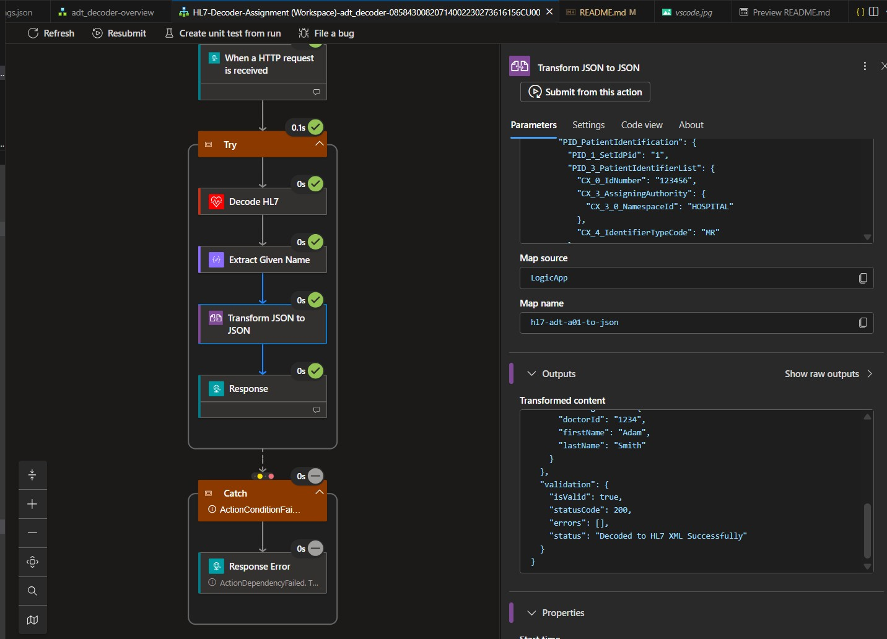
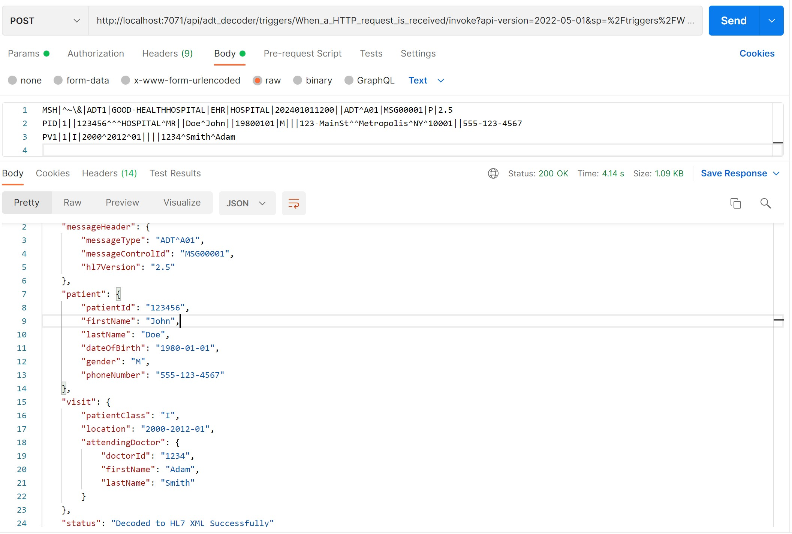
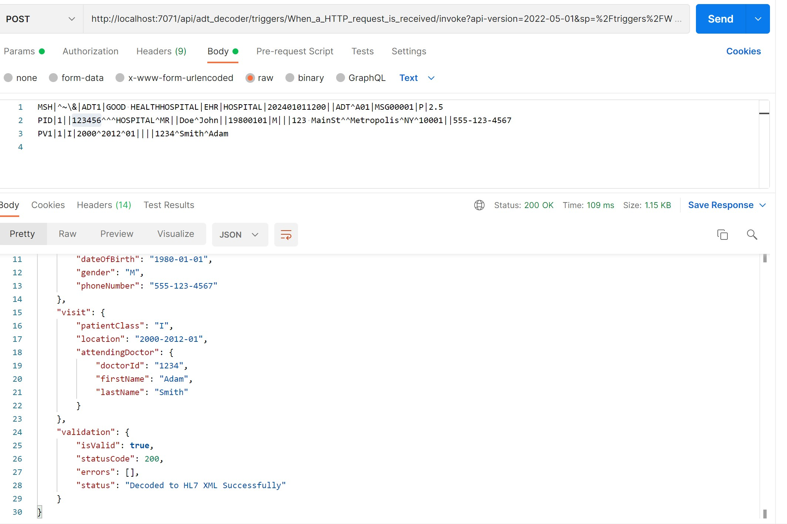
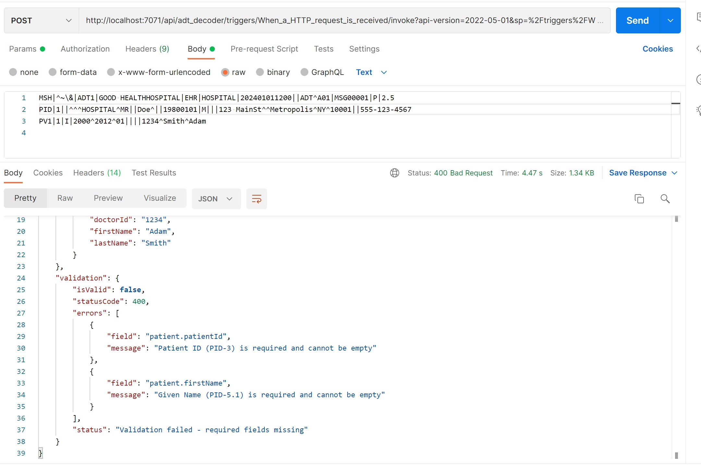

# HL7-Decoder-Assignment


## Prerequisites

- An Azure Integration Account is required.
- Upload the HL7 v2.5 below schemas to the Integration Account before running this project.
	- `ADT_A01_25_GLO_DEF.xsd`
	- `segments_25.xsd`
	- `datatypes_25.xsd`
	- `tablevalues_25.xsd`

## Project Structure

**Key Folders:**
- **`adt_decoder/`** - Contains the Logic App workflow definition
- **`Artifacts/Maps/`** - Liquid templates for HL7 to JSON transformation with validation logic
- **`intigrationaccount/Schemas/`** - HL7 v2.5 XSD schemas to upload to Azure Integration Account
- **`outputs/`** - Sample test requests/responses and screenshots demonstrating the workflow

## Local setup

1. Open the project folder in VS Code:
	 - `c:\Data2\HL7-Decoder-Assignment\HL7-Decoder-Assignment`
2. Open this workspace folder:
	 - `la-hl7-decoder-assignment`
3. In `la-hl7-decoder-assignment`, create a file named `local.settings.json`.
4. Paste the following settings into `local.settings.json`.

```json
{
	"IsEncrypted": false,
	"Values": {
		"APP_KIND": "workflowapp",
		"ProjectDirectoryPath": "c:\\XXX..\\HL7-Decoder-Assignment\\HL7-Decoder-Assignment",
		"FUNCTIONS_WORKER_RUNTIME": "dotnet",
		"AzureWebJobsStorage": "UseDevelopmentStorage=true",
		"FUNCTIONS_INPROC_NET8_ENABLED": "1",
		"WORKFLOWS_TENANT_ID": "<YOUR_TENANT_ID>",
		"WORKFLOWS_SUBSCRIPTION_ID": "<YOUR_SUBSCRIPTION_ID>",
		"WORKFLOWS_RESOURCE_GROUP_NAME": "<YOUR_RESOURCE_GROUP_NAME>",
		"WORKFLOWS_LOCATION_NAME": "eastus",
		"WORKFLOWS_MANAGEMENT_BASE_URI": "https://management.azure.com/",
		"WORKFLOWS_AUTHENTICATION_METHOD": "managedServiceIdentity",
		"WORKFLOW_INTEGRATION_ACCOUNT_CALLBACK_URL": "<YOUR_INTEGRATION_ACCOUNT_CALLBACK_URL>"
	}
}
```

### Notes

- Replace values specific to your subscription before running locally and make sure you added WORKFLOW_INTEGRATION_ACCOUNT_CALLBACK_URL


## Design decisions

- Logic App Standard is used so the workflow can run locally in VS Code.
- HTTP trigger is used to accept HL7 input for easy testing with Postman/curl.
- HL7 schema decoding is delegated to the Integration Account artifacts.


## XPath expressions (reference)

I did not use XPath in the implementation. The following are sample XPath expressioni just added in the code, based on a decoded `ADT_A01_25_GLO_DEF` output.


- Patient First Name (`John`):
```json
	{
  "type": "Compose",
  "inputs": "@xpath(xml(body('Decode_HL7')['messageContent']), '//*[local-name()=\"XPN_1_GivenName\"]/text()')?[0]",
  "runAfter": {
    "Decode_HL7": [
      "Succeeded"
    ]
  }
}
```

## Mandatory Validations

The project implements field validation using **Liquid templates** during the JSON transformation step. This approach validates required fields and returns appropriate HTTP status codes based on validation results.

### Implementation Approach

**Liquid Map Validation** (Current Implementation)
- Validation logic is embedded in the `hl7-adt-a01-to-json.liquid` transformation map
- Required fields are assigned to variables and checked for `nil`, `blank`, `empty`, or `""`
- The output JSON includes a `validation` section with:
  - `isValid`: boolean flag
  - `statusCode`: 200 (success) or 400 (validation failure)
  - `errors`: array of validation error objects with field name and message
  - `status`: descriptive status message
- The workflow's Response action dynamically uses the statusCode from the Liquid output

### Example Validations

The following mandatory fields are currently validated:

1. **Patient ID (PID-3)** - Must be present and non-empty
   ```liquid
   
   
   ```

2. **Patient Given Name (PID-5.1)** - Must be present and non-empty
   ```liquid
   
   
   ```

### Sample Validation Response

**When validation fails:**
```json
{
  "validation": {
    "isValid": false,
    "statusCode": 400,
    "errors": [
      {
        "field": "patient.patientId",
        "message": "Patient ID (PID-3) is required and cannot be empty"
      },
      {
        "field": "patient.firstName",
        "message": "Given Name (PID-5.1) is required and cannot be empty"
      }
    ],
    "status": "Validation failed - required fields missing"
  }
}
```

### Alternative Validation Approaches

While Liquid template validation is currently implemented, other options include:

1. **XPath-based Validation**(but for a limited fields)
  
2. **Azure Function Validation**

3. **XML Schema Validation (XSD)**

The Liquid template approach was chosen for its simplicity, minimal latency, and ability to combine transformation and validation in a single step.

## Sample test requests and responses

### Sample request (HTTP body)

```text
MSH|^~\&|ADT1|GOOD HEALTHHOSPITAL|EHR|HOSPITAL|202401011200||ADT^A01|MSG00001|P|2.5
PID|1||123456^^^HOSPITAL^MR||Doe^John||19800101|M|||123 MainSt^^Metropolis^NY^10001||555-123-4567
PV1|1|I|2000^2012^01||||1234^Smith^Adam

```

### Sample success response (example)

```json
{
    "messageHeader": {
        "messageType": "ADT^A01",
        "messageControlId": "MSG00001",
        "hl7Version": "2.5"
    },
    "patient": {
        "patientId": "123456",
        "firstName": "John",
        "lastName": "Doe",
        "dateOfBirth": "1980-01-01",
        "gender": "M",
        "phoneNumber": "555-123-4567"
    },
    "visit": {
        "patientClass": "I",
        "location": "2000-2012-01",
        "attendingDoctor": {
            "doctorId": "1234",
            "firstName": "Adam",
            "lastName": "Smith"
        }
    },
    "validation": {
        "isValid": true,
        "statusCode": 200,
        "errors": [],
        "status": "Decoded to HL7 XML Successfully"
    }
}
```
### Sample Invlaid request (HTTP body)

```text
MSH|^~\&|ADT1|GOOD HEALTHHOSPITAL|EHR|HOSPITAL|202401011200||ADT^A01|MSG00001|P|2.5
PID|1||^^^HOSPITAL^MR||Doe^||19800101|M|||123 MainSt^^Metropolis^NY^10001||555-123-4567
PV1|1|I|2000^2012^01||||1234^Smith^Adam

```
### Sample error response (example)

```json
{
    "messageHeader": {
        "messageType": "ADT^A01",
        "messageControlId": "MSG00001",
        "hl7Version": "2.5"
    },
    "patient": {
        "patientId": "",
        "firstName": "",
        "lastName": "Doe",
        "dateOfBirth": "1980-01-01",
        "gender": "M",
        "phoneNumber": "555-123-4567"
    },
    "visit": {
        "patientClass": "I",
        "location": "2000-2012-01",
        "attendingDoctor": {
            "doctorId": "1234",
            "firstName": "Adam",
            "lastName": "Smith"
        }
    },
    "validation": {
        "isValid": false,
        "statusCode": 400,
        "errors": [
            {
                "field": "patient.patientId",
                "message": "Patient ID (PID-3) is required and cannot be empty"
            },
            {
                "field": "patient.firstName",
                "message": "Given Name (PID-5.1) is required and cannot be empty"
            }
        ],
        "status": "Validation failed - required fields missing"
    }
}
```

## Assumptions

- `local.settings.json` contains valid values for tenant/subscription/resource group/location and callback URL.
- Invalid HL7 messages are not handled in the current implementation,I ass it is not timing out..something we have to check on it..
- The output structure was modified slightly to include a `validation` section with field-level error reporting and dynamic HTTP status codes.

## Screenshots

### VS Code Workflow Designer


### Postman Testing


### XPath Extraction Example


### Validation Success


### Validation Error


## Reference
- Getting HL7 v2.5 schemas was a challenge. I was able to get them by renting an Azure BizTalk VM

---

<p align="center">
<em>I was able to do a nice Readme document with the help of co-pilot 😊 thanks to co-pilot</em>
</p>
